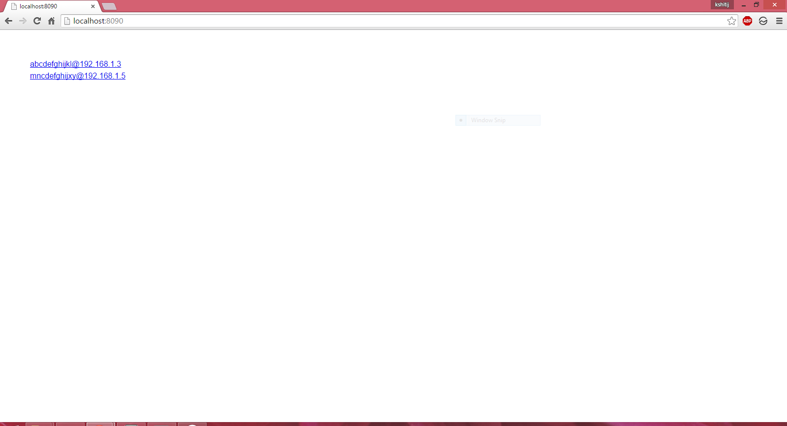
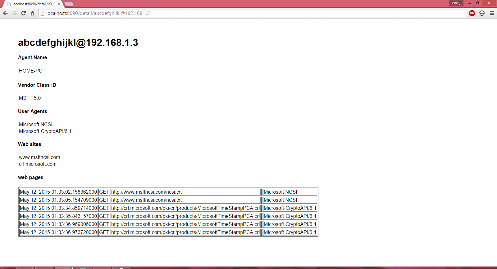

insight
===========
it is a *packet anaylsis* tool but with goal of providing you **information about users** instead of packet.
Right now we have too many things in wish list than in feature list

### Requirment
> tshark for reading packet

### Help needed
We are open for suggestion or feedback or any comment or help

# What to do with it 
Give it capture file which tshark can read and it will give you information about different users using and that network and what they are doing.

## Example
It conatains a sample capture file and code for parsing it
and web UI is presented with express, jade
we don't support GUI we support WEB UI
as it is portable and cross platform and can be accessed from any other device

*for analysing file run collector*
'node collector.js'

*for runing web UI*
'node web_app.js'

